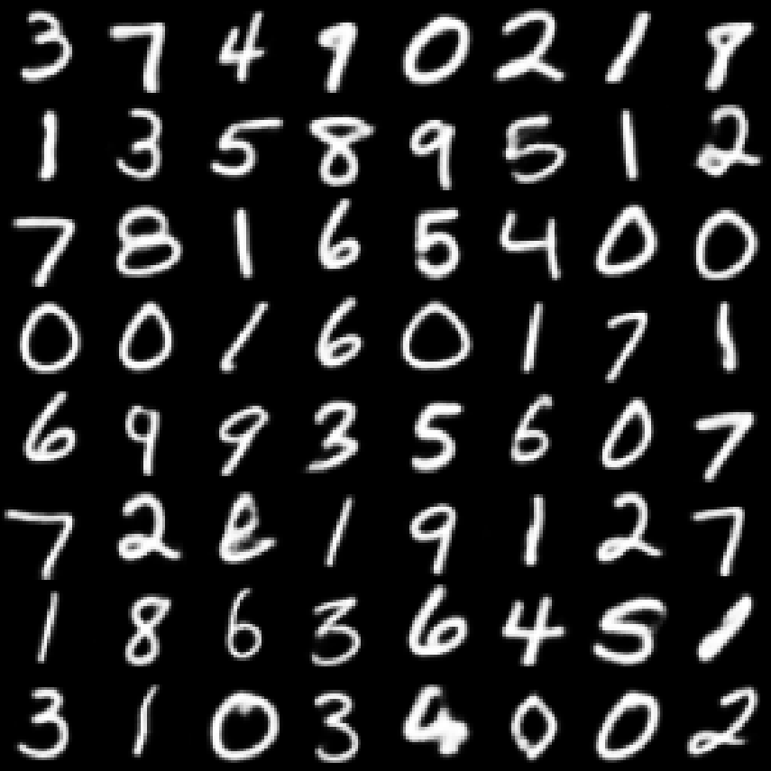
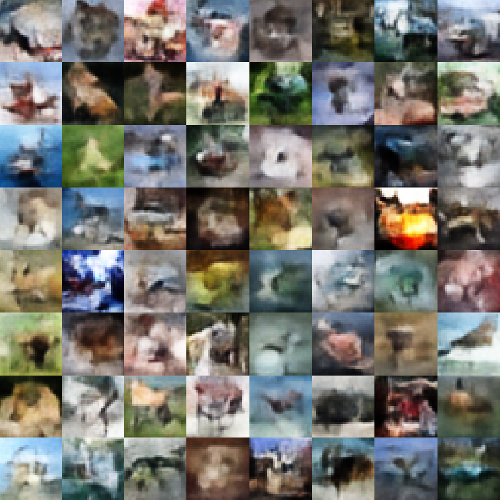
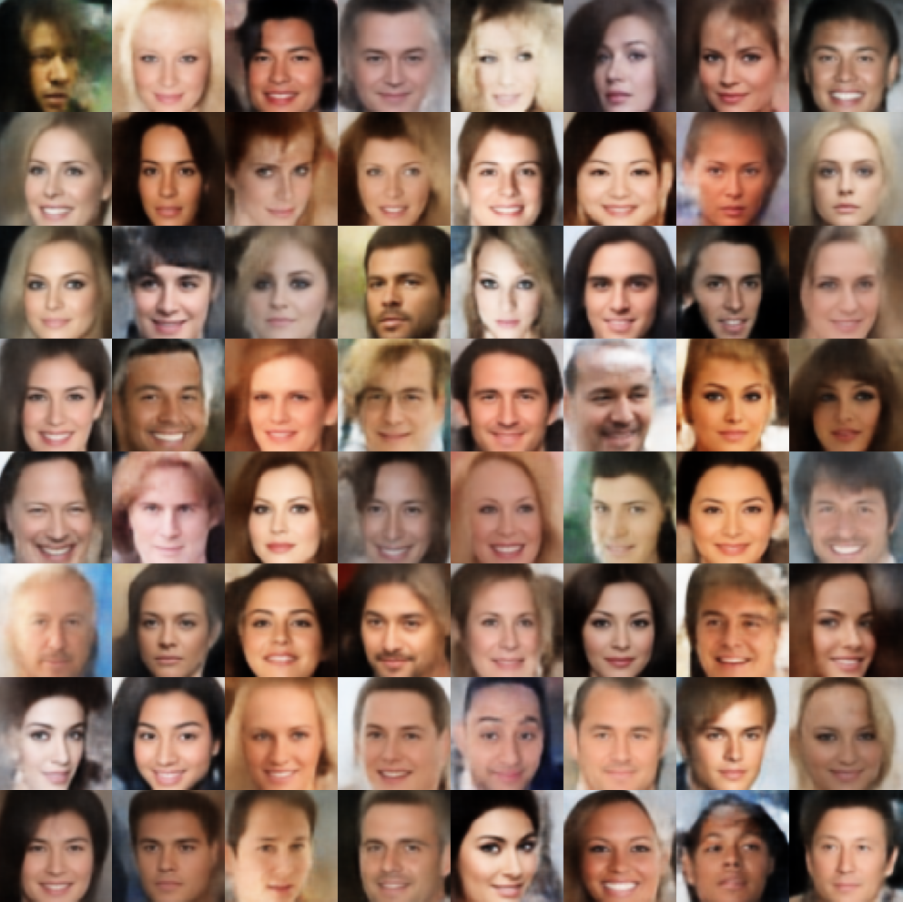

# Implementation for Distribution Matching in Deep Generative Models with Kernel Transfer Operators
Required packages: PyTorch (1.5+), numpy, jax, neural-tangent, scikit-learn, scikit-image, tqdm, matplotlib, visdom (for visualization)

Due to the use of mixed PyTorch and jax, the code is currently only supported on machines with at least 2 gpus if neural tangent kernel is used (GPU 0 for closed-form kernel computation in jax, and GPU 1 for other PyTorch operations). 

To learn and generate samples from the toy densities using the kernel PF operator, use

```
python flow_toy.py --experiment_id <name> --density_estimator kpf
```

Image generation is based on 'ex-post' density estimation using kernel PF operator on the latent space of a (regularized sperical) autoencoder. To train a new autoencoder and learn the operator, use
```
python train_pf_generation.py --config configs/<dataset>/<dataset>_sn_spehricial_<density estimator>.yaml
```
Available dataset options are ['mnist', 'cifar10', 'celeba64'] and available density estimators are ['kpf' (kernel PF operator), 'gmm' (10-component Gaussian Mixture Model), 'glow', 'vae']

All standard computer vision datasets used in this work are publicly available. To prepare the 64x64 CelebA image dataset, first download the 'img_align_celeba.zip' file under the 'Annotated&Cropped Images' tab from http://mmlab.ie.cuhk.edu.hk/projects/CelebA.html and unzip to ./data/celeba. Then run
```
python preprocess.py
```
to preprocess the images and store them in hdf5 format (after preprocessing, the hdf5 files will be available under ./data/celeba). 

## Sample generations
```
python train_pf_generation.py --config configs/mnist/mnist_sn_spherical_kpf.yaml
```



```
python train_pf_generation.py --config configs/cifar10/cifar10_sn_spherical_kpf.yaml
```



```
python train_pf_generation.py --config configs/mnist/mnist_sn_spherical_kpf.yaml
```

